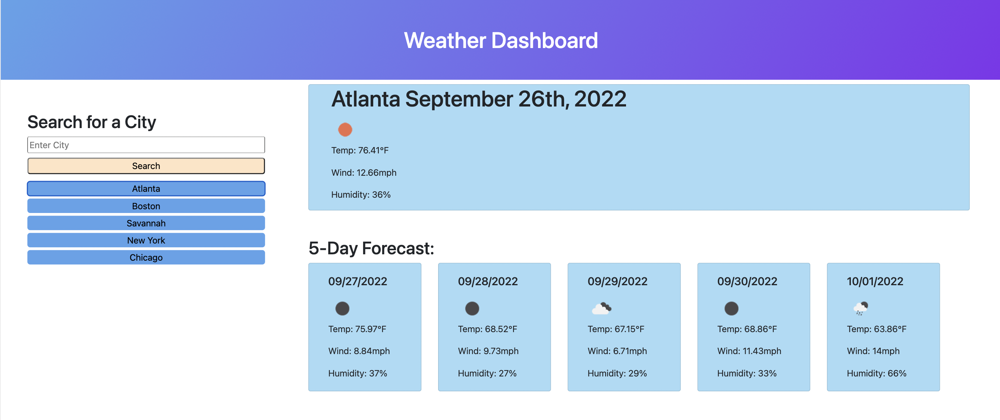

# Weather-Dashboard

## Description
This weather dashboard i sused to view a locations current weather and the weather for hte next 5 days.
## Installation
N/A

## Usage
The user may type in their desired city, or if they have searched in the past they may click from the list of buttons below the search bar. Either option will lead to a new page with the current date, temperature, wind speed, humidity and an icon representing the weather condition. Below the current weather there will be a 5 smaller cards representing the next 5 days of weather, with the same information.

Note: UV index is not available due to openweather one-call not being free anymore, and open weather discontinuing the  individual UV Index API, and pushing their subscription based service.

## Credits
N/A
## License
N/A

## Link to Application
[Link to Application](https://cgordon5025.github.io/Weather-Dashboard/)

